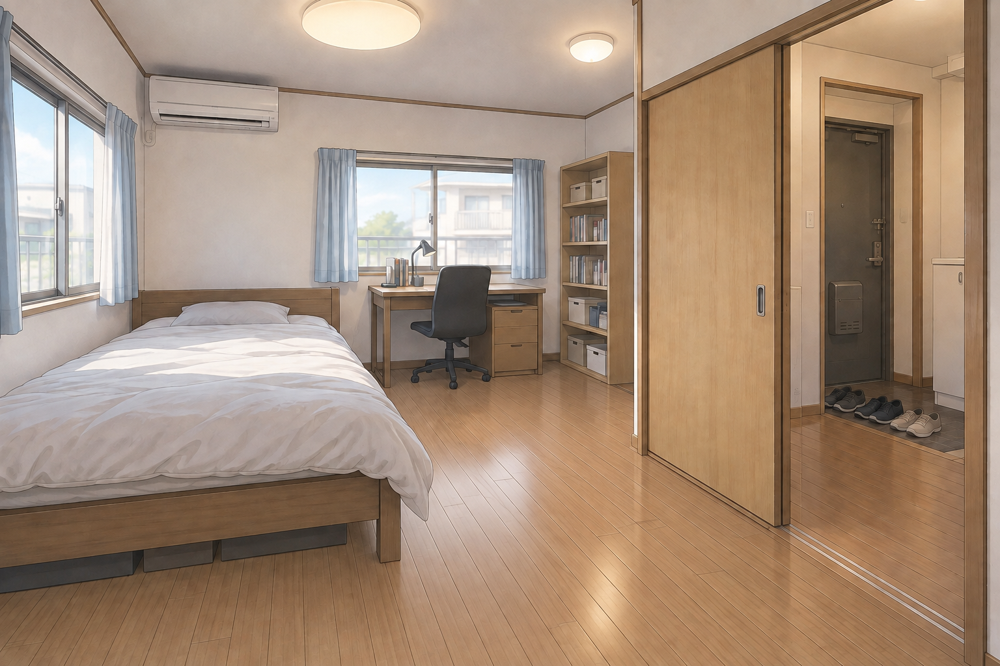
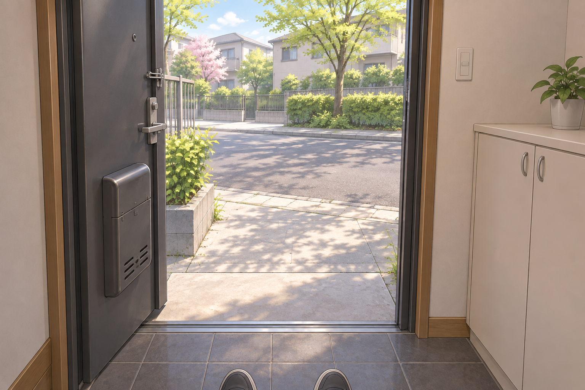
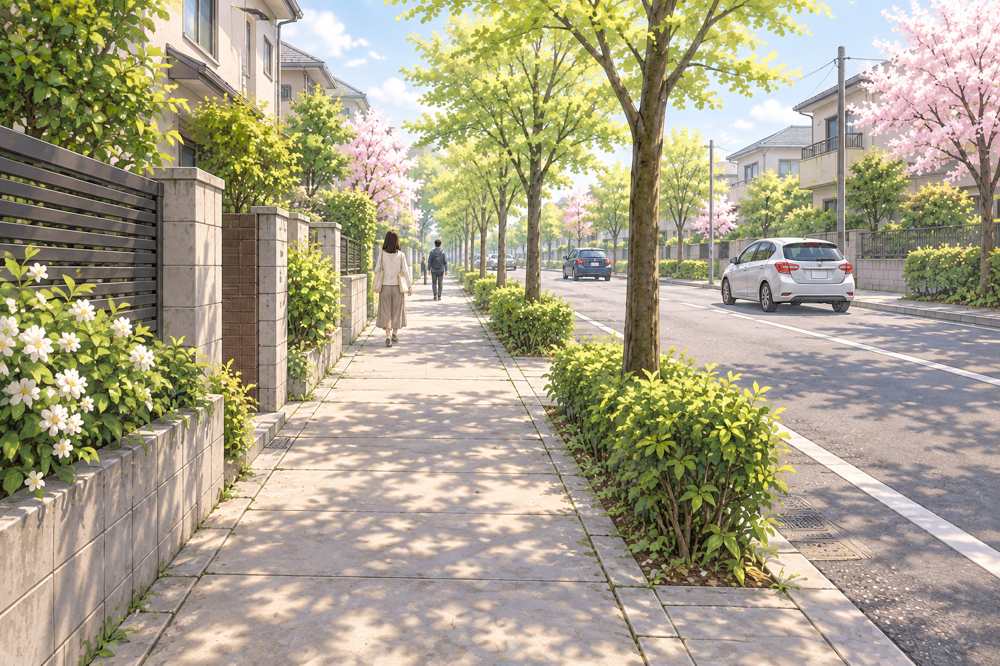

# 試用例：ベッドから道へ

この例は `custom-tmr-imagery-maker` の試用対話で確認した内容を、公開用に匿名化・要約したものです。対話全文ではなく、個人名・地域・住所は記載していません。画像3枚は場面を説明するためのAI生成イラストで、実際の部屋や道路の写真ではありません。悪夢の改善効果を示す事例ではありません。

## 困っていた展開

夢の中で、普段寝ている部屋に似た場所のベッドから立ち、歩き始める。歩くことはでき、夢の中では足の裏の感覚もある。しかし一定の距離を進むと、瞬間的に同じ位置へ戻される。何度歩いても先へ進めないことが嫌だった。ここでいう足の感覚は夢の中の体験であり、実際に寝ている足が床に触れているという意味ではない。

## 聞き取りで選んだ望ましい展開

- 出発点は、6〜8畳ほどのワンルーム。床は畳ではなくフローリング。白い壁、ベッド、勉強机、棚、窓2つ、エアコン、照明がある。
- ベッドから歩いて引き戸を開けると、靴が並ぶ玄関が見える。靴を履き、玄関のドアから外へ出る。
- 外は春の木漏れ日のような穏やかな晴天。暑すぎず、湿気の少ないさらりとした風が吹く。
- 道路沿いには車と歩行者がいる。それらを横目に歩き続け、以前は戻されていた距離を越えてもベッドへ戻らない。

## 確認済みの要素から再構成した場面の文章

> 夢の中で、ベッドのあるワンルームにいる。白い壁、勉強机、棚、二つの窓が見える。足元はフローリングだ。ベッドから立ち上がって歩き、引き戸を開ける。玄関には靴が並んでいる。靴を履き、玄関のドアを開けて外へ出る。春のやわらかな日差しと、湿気の少ないそよ風が心地よい。道を歩くと、車や歩行者が横を通る。これまで戻されていた距離を越えても景色は先へ続き、自分の足で歩き続けられる。ベッドへは戻らない。

この文章は試用対話の内容を公開用に編集した再構成であり、発言の逐語記録ではありません。確認済みなのは場面の方向性と要素で、この文章表現そのものではありません。

## 3つの場面画像

1. 部屋から歩き、引き戸を開ける。玄関の靴が見える。

   

2. 靴を履き、玄関のドアから外へ出る。

   

3. 車や歩行者を横目に、道を歩き続ける。

   

画像には、家並みや樹木など生成時に補われた細部があります。画像の見た目を、本人が語った内容の逐語的な再現や実際の記憶の記録として扱わないでください。

## この例で確かめられるスキルの振る舞い

- 抽象的に「どう解決するか」と迫らず、夢の中で起こることと嫌な点を一問ずつ聞く。
- 夢の中の足の感覚と、寝ている実際の体の状態を混同しない。
- 「歩く」だけで完成にせず、部屋から玄関、外の道、その先へと場面のつながりを本人に確認する。
- 靴を履くか、外の天候をどうしたいかなど、本人の選択を反映する。
- 音との関連づけや悪夢改善の結果を、この例から推測しない。
